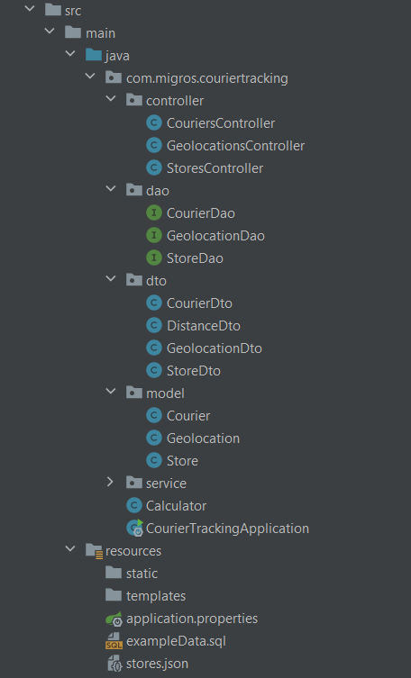

**COURIER TRACKING**

Courier Tracking is a restful web application with Java, that mainly
takes streaming geolocations of couriers (time, courier, lat, lng) as input.

- The application logs courier and store when any courier enters radius of 100 meters from Migros
  stores. Reentries to the same store's circumference over 1 minute are not count
  as "entrance". Store locations are given as stores.json file.
- The application provides a way for querying total distances, over which any
  courier travels.

**TECHOLOGY STACK** 

- Java 8
- Spring Boot
- Swagger
- Apache Maven
- Spring Data JPA
- ModelMapper
- PostgreSQL
- IntelliJ IDEA

**PROJECT STRUCTURE**

**APPLICATION COMPONENTS**

Controllers :
- _CouriersController_ : adds new courier, gets list of specific stores (which courier's distance in meters is smaller than 100 meters and courier's distance in minutes is bigger than 1 minute), gets total travel distance of the courier given by id.
- _GeolocationsController_ : adds new geolocation of courier.
- _StoresController_ : adds new store.

**PROJECT SETUP**

- git clone https://github.com/zeynepkesim/CourierTracking
- run CourierTrackingApplication class

**API DOCUMENTATION**

- http://localhost:8080/swagger-ui.html#/